In this page we will explore a set of Citi Bike usage data and users' usage patterns.

```{r, eval=FALSE}
# Load packagea
library(tidyverse)
library(lubridate)

# Import data
data <- read_csv("./data/citibike_sample_12k.csv")

# Data Preprocessing
# Calculate ride duration in minutes
data =
  data |>
  mutate(
    started_at = ymd_hms(started_at),
    ended_at = ymd_hms(ended_at),
    duration_min = as.numeric(difftime(ended_at, started_at, units = "mins")),
    month = floor_date(started_at, "month"),
    month_label = format(started_at, "%Y-%m")
  ) |>
   filter(year(started_at) == 2024)

# Filter out anomalies (duration between 0 and 200 minutes)
data_clean =
  data |>
  filter(duration_min > 0 & duration_min < 200)

## Monthly statistics
monthly_stats =
  data_clean |>
  group_by(month_label, rideable_type) |>
  summarize(
    ride_count = n(),                              
    total_duration = sum(duration_min),            
    avg_duration = mean(duration_min),             
    total_duration_hours = total_duration / 60,
    .groups = "drop"
  ) |>
  arrange(month_label)

monthly_stats
```

# Temporal Patterns

```{r, eval=FALSE}
hourly_usage =
  data_clean |>
  mutate(hour = hour(started_at)) |>
  group_by(hour, rideable_type) |>
  summarize(ride_count = n(), .groups = "drop") |>
  mutate(time_label = sprintf("%02d:00", hour)) |>
  ggplot(aes(x = time_label, y = ride_count, 
            color = rideable_type, group = rideable_type)) +
  geom_line(linewidth = 1.2) +
  geom_point(size = 3) +
  scale_color_manual(values = c("classic_bike" = "#FFBE98", 
                              "electric_bike" = "#A8DAFF"),
                  labels = c("Classic Bike", "Electric Bike")) +
  labs(
    title = "Hourly Usage Pattern by Bike Type",
    x = "Hour of Day",
    y = "Number of Rides",
    color = "Bike Type"
  ) +
  theme_minimal() +
  theme(
    plot.title = element_text(hjust = 0.5, face = "bold"),
    legend.position = "top"
  ) 
hourly_usage
```

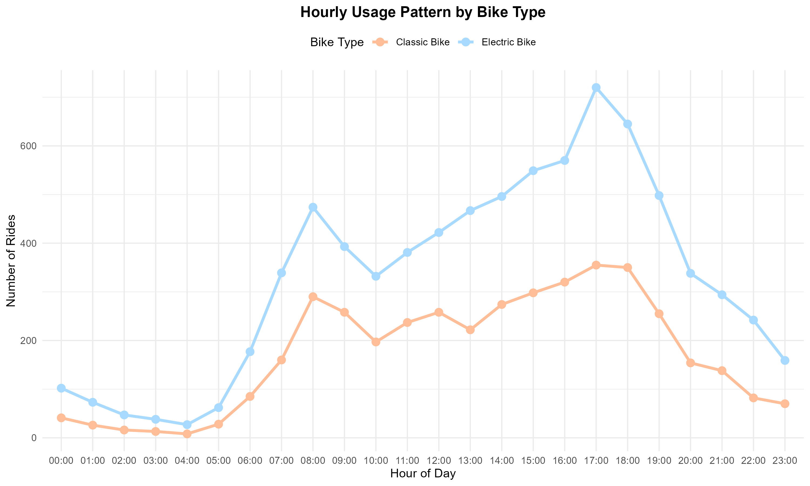

# User Behavior Analysis

To compare the behavioral patterns of Citi Bike members and casual riders, we analyzed the cleaned 2024 trip dataset with a focus on two key indicators: average ride duration and monthly ride counts. The visualizations reveal clear and consistent differences between the two groups across the entire year.

```{r, eval=FALSE}
# Average Duration Comparison
avg_duration = 
  monthly_stats |>
  ggplot(
    aes(x = month_label, y = avg_duration,
        color = rideable_type, group = rideable_type)) +
    geom_line(linewidth = 1.2) +
    geom_point(size = 3) +
    geom_text(aes(label = round(avg_duration, 1)), 
              vjust = -1, 
              size = 5,
              show.legend = FALSE) +
    scale_color_manual(values = c("classic_bike" = "#FFBE98", 
                              "electric_bike" = "#A8DAFF"),
                  labels = c("Classic Bike", "Electric Bike")) +
    labs(
      title = "Average Ride Duration Comparsion by Bike Type",
      x = "Month",
      y = "Average Duration (minutes)",
      color = "Bike Type"
    ) +
    theme_minimal() +
    theme(
      axis.text.x = element_text(angle = 45, hjust = 1),
      plot.title = element_text(hjust = 0.5, face = "bold"),
      legend.position = "top"
    )

# Calculate ride duration in minutes
data =
  data |>
  mutate(
    started_at = ymd_hms(started_at),
    ended_at = ymd_hms(ended_at),
    duration_min = as.numeric(difftime(ended_at, started_at, units = "mins")),
    month = floor_date(started_at, "month"),
    month_label = format(started_at, "%Y-%m")
  ) |>
   filter(year(started_at) == 2024)

# Filter out anomalies (duration between 0 and 200 minutes)
data_clean =
  data |>
  filter(duration_min > 0 & duration_min < 200)

glimpse(
  data_clean
)

## duration

duration_monthly <- data_clean %>%
  group_by(month_label, member_casual) %>%
  summarise(
    avg_duration = mean(duration_min, na.rm = TRUE),
    median_duration = median(duration_min, na.rm = TRUE),
    n = n(),
    .groups = "drop"
  )

duration_monthly

ggplot(duration_monthly, aes(
  x = month_label,
  y = avg_duration,
  color = member_casual,
  group = member_casual
)) +
  geom_line(size = 1.2) +
  geom_point(size = 2) +
  labs(
    title = "Monthly Average Ride Duration: Members vs Casual Riders",
    x = "Month",
    y = "Average Duration (minutes)",
    color = "User Type"
  ) +
  theme_minimal() +
  theme(
    axis.text.x = element_text(angle = 45, hjust = 1)
  )

ggplot(duration_monthly, aes(
  x = month_label,
  y = avg_duration,
  fill = member_casual
)) +
  geom_col(position = "dodge") +
  labs(
    title = "Average Ride Duration by Month: Members vs Casual Riders",
    x = "Month",
    y = "Average Duration (minutes)",
    fill = "User Type"
  ) +
  theme_minimal() +
  theme(axis.text.x = element_text(angle = 45, hjust = 1))

## counts

count_monthly <- data_clean %>%
  group_by(month_label, member_casual) %>%
  summarise(
    ride_count = n(),
    .groups = "drop"
  )

count_monthly

ggplot(count_monthly, aes(
  x = month_label,
  y = ride_count,
  fill = member_casual
)) +
  geom_col(position = "dodge") +
  labs(
    title = "Monthly Ride Counts: Members vs Casual Riders",
    x = "Month",
    y = "Number of Rides",
    fill = "User Type"
  ) +
  theme_minimal() +
  theme(
    axis.text.x = element_text(angle = 45, hjust = 1)
  )
```

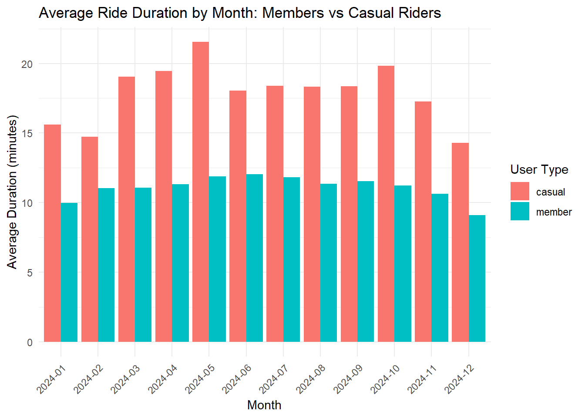 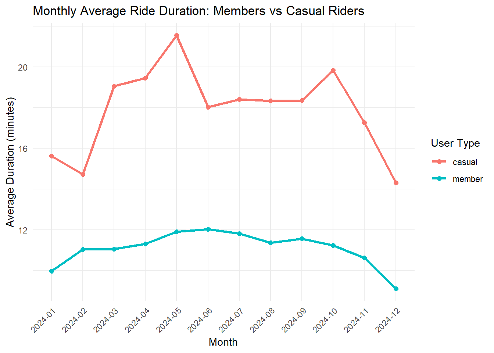

In terms of ride duration, casual riders consistently take longer trips than members in every month of 2024. Overall, casual riders typically spend between 15 and 21 minutes per trip, whereas members maintain a much shorter and more stable range of roughly 10 to 12 minutes. A noticeable spike in casual ride duration appears around April and May, which further widens the gap between the two user types. These differences align with the well-established behavioral patterns of Citi Bike users: casual riders often engage in leisure, tourism, or exploratory rides, which naturally leads to longer trip times, while members tend to use bikes for commuting or short point-to-point travel, resulting in shorter, more predictable ride durations.

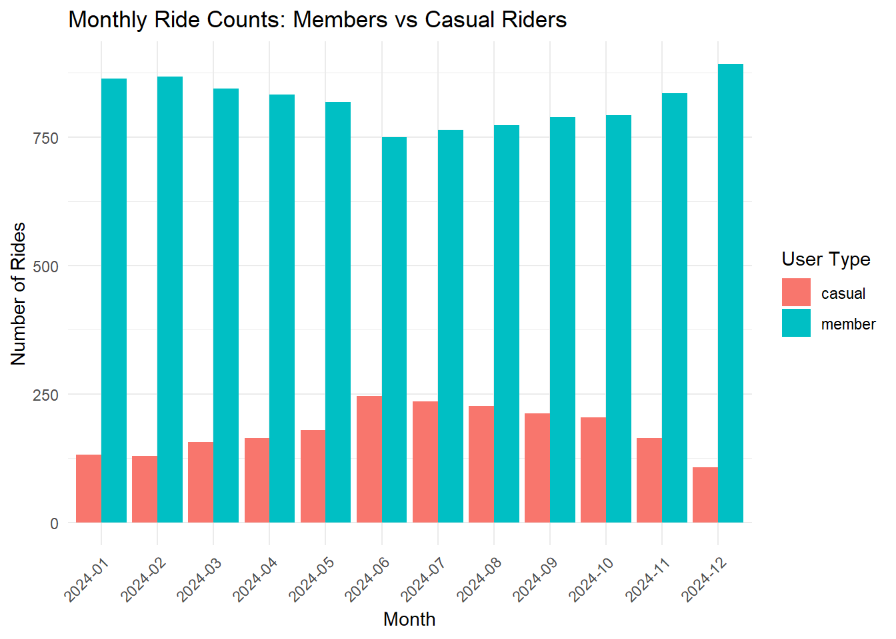

The pattern becomes even more striking when examining ride frequency. Although casual riders spend more time per trip, overall system usage is overwhelmingly driven by members. In our dataset, members consistently completed around 750 to 850 trips per month, compared with significantly fewer trips from casual riders. Furthermore, casual ridership exhibits strong seasonality—low in winter, peaking during the summer months, and declining again in the fall—while member ridership remains comparatively stable throughout the year. This stability reinforces the idea that members rely on Citi Bike for routine, utilitarian transportation, whereas casual users are more sensitive to weather and seasonal tourism patterns.

```{r, eval=FALSE}
citibike_boxplot <- data %>%
  mutate(
    started_at = ymd_hms(started_at),
    ended_at = ymd_hms(ended_at),
    duration_min = as.numeric(difftime(ended_at, started_at, units = "mins")),
    month = month(started_at, label = TRUE, abbr = TRUE)) %>%
  filter(duration_min > 0, duration_min < 200)

# plot
plot_ly(
  data = citibike_boxplot,
  x = ~month,
  y = ~duration_min,
  type = "box",
  color = ~month,
  colors = "viridis",
  boxpoints = "outliers",  
  marker = list(
    size = 6,       
    opacity = 1  
  ),
  line = list(width = 1)    
) %>%
  layout(
    title = "Monthly Ride Duration Distribution (Citibike)",
    xaxis = list(title = "Month"),
    yaxis = list(title = "Ride Duration (minutes)")
  )
```

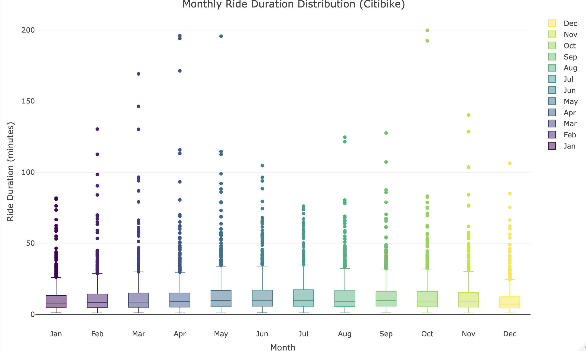

The figure above presents the monthly distribution of cycling data over a 12-month period. The distribution of Citibike ride durations shows a strong seasonal pattern. Winter months have the shortest and most uniform ride times, suggesting essential and short-distance travel. As temperatures increase in spring and peak in summer, both median duration and variability rise, accompanied by more long rides exceeding 100 minutes. These patterns indicate that warm weather months encourage longer and more diverse cycling activities, while colder seasons constrain both duration and behavioral variability.

# Bike Type Comparison

### Monthly ride count comparison by bike type

```{r, eval=FALSE}
total_ride =
  monthly_stats |>
  ggplot(
    aes(x = month_label, y = ride_count, 
        fill = rideable_type)) +
  geom_col(position = position_dodge()) +
  geom_text(aes(label = ride_count),
            vjust = -0.5, 
            size = 3.5) +
  scale_fill_manual(values = c("classic_bike" = "#FFBE98", 
                              "electric_bike" = "#A8DAFF"),
                  labels = c("Classic Bike", "Electric Bike")) +
  labs(
    title = "Monthly Ride Count Comparison by Bike Type",
    x = "Month",
    y = "Total Number of Rides",
    fill = "Bike Type"
  ) +
  theme_minimal() +
  theme(
    plot.title = element_text(hjust = 0.5, face = "bold", size = 16),
    axis.text.x = element_text(angle = 45, hjust = 1),
    legend.position = "top"
  )

total_ride
```

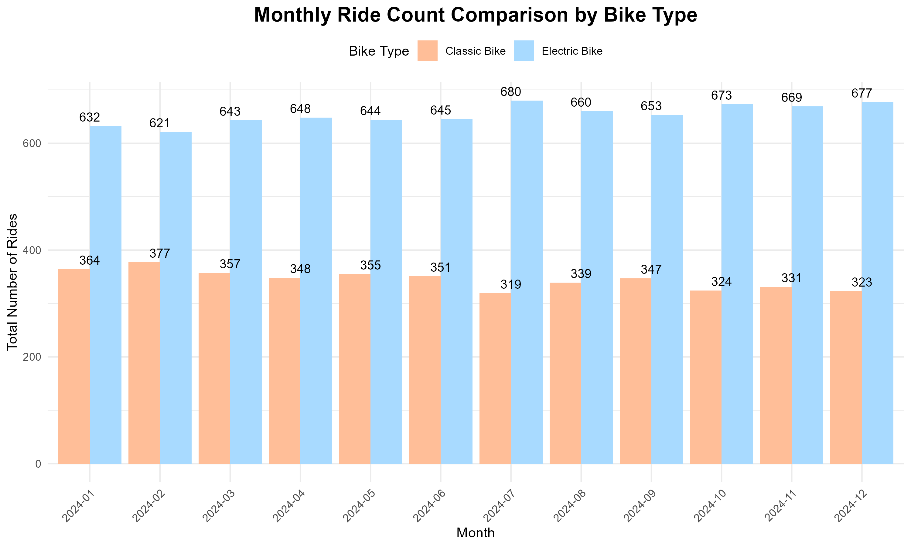

Both bike types maintain relatively stable usage patterns throughout the year with minimal monthly fluctuation. Classic bike usage hits its lowest point in July (319 rides), possibly due to excessive heat. The usage of electric bikes is approximately twice that of classic bikes, averaging around 650 and 340 rides per month, respectively. Electric bikes are clearly more popular, likely because they require less physical effort and better serve practical purposes like commuting.

### Average ride duration comparison by bike type

```{r, eval=FALSE}
avg_duration = 
  monthly_stats |>
  ggplot(
    aes(x = month_label, y = avg_duration,
        color = rideable_type, group = rideable_type)) +
    geom_line(linewidth = 1.2) +
    geom_point(size = 3) +
    geom_text(aes(label = round(avg_duration, 1)), 
              vjust = -1, 
              size = 5,
              show.legend = FALSE) +
    scale_color_manual(values = c("classic_bike" = "#FFBE98", 
                              "electric_bike" = "#A8DAFF"),
                  labels = c("Classic Bike", "Electric Bike")) +
    labs(
      title = "Average Ride Duration Comparsion by Bike Type",
      x = "Month",
      y = "Average Duration (minutes)",
      color = "Bike Type"
    ) +
    theme_minimal() +
    theme(
      axis.text.x = element_text(angle = 45, hjust = 1),
      plot.title = element_text(hjust = 0.5, face = "bold"),
      legend.position = "top"
    )
avg_duration
```

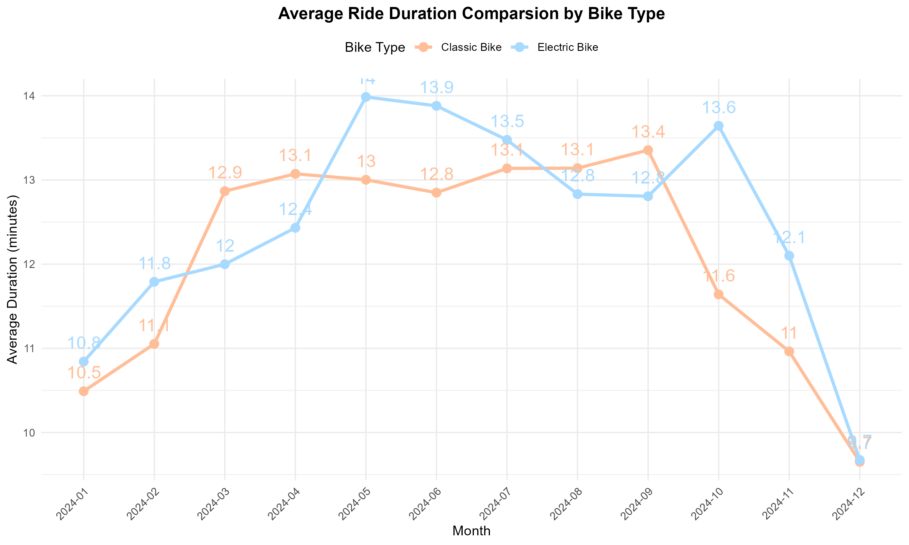

Both bike types show clear seasonal trends, with longer rides during warmer months (May-October) and shorter rides in winter months (January, February, December). December shows a dramatic drop for both types, falling to around 9.7 minutes. The gap is most pronounced in spring/summer (April-July), where electric bikes average 0.5-1 minute longer per ride. In fall/winter months (September-December), the two converge, with classic bikes surpassing electric bikes briefly in September. Electric bikes generally have slightly longer average duration than classic bikes during most months. This may be because the electric assist enables them to travel farther distances comfortably. Classic bike riders maintain more consistent duration (11-13.4 minutes), suggesting they use bikes for predictable short trips.

### Market share trend by bike type

```{r, eval=FALSE}
mkt_share =
  data_clean |>
  group_by(month_label, rideable_type) |>
  summarize(ride_count = n(), .groups = "drop") |>
  group_by(month_label) |>
  mutate(
    total = sum(ride_count),
    percentage = (ride_count / total) * 100
  ) |>
  ggplot(aes(x = month_label, y = percentage, 
             fill = rideable_type)) +
  geom_col(position = "stack") +
  geom_text(aes(label = paste0(round(percentage, 1), "%")), 
            position = position_stack(vjust = 0.5),
            size = 3,
            color = "white",
            fontface = "bold") +
  scale_fill_manual(values = c("classic_bike" = "#FFBE98", 
                              "electric_bike" = "#A8DAFF"),
                  labels = c("Classic Bike", "Electric Bike")) +
  labs(
    title = "Market Share Trend by Bike Type",
    x = "Month",
    y = "Percentage (%)",
    color = "Bike Type"
  ) +
  theme_minimal() +
  theme(
    axis.text.x = element_text(angle = 45, hjust = 1),
    plot.title = element_text(hjust = 0.5, face = "bold"),
    legend.position = "top"
  ) +
  ylim(0, 100)
mkt_share
```

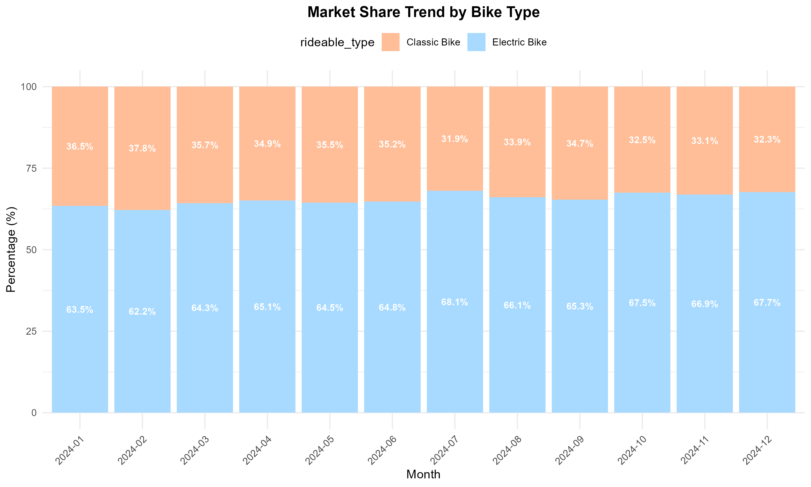

Electric bikes consistently dominate the market, holding approximately 65% market share throughout the year. Electric bikes gain approximately 4.5 % points of market share over the year. Electric bike share gradually increases from 63.5% (January) to peak at 68.1% (July), then stabilizes around 66-68% for the remainder of the year, while classic bikes experience a corresponding decline from 36.5% (January) to a low of 31.9% (July).

### Bike type preference by user type

```{r, eval=FALSE}
user_bike_pref =
  data_clean |>
  group_by(member_casual, rideable_type) |>
  summarize(ride_count = n(), .groups = "drop") |>
  group_by(member_casual) |>
  mutate(
    percentage = (ride_count / sum(ride_count)) * 100
    ) |>
  ggplot(
    aes(x = member_casual, y = percentage, fill = rideable_type)) +
  geom_col(position = position_dodge()) +
  geom_text(aes(label = paste0(round(percentage, 1), "%")), 
            position = position_dodge(width = 0.9), 
            vjust = -0.5,
            size = 4) +
  scale_fill_manual(values = c("classic_bike" = "#FFBE98", 
                              "electric_bike" = "#A8DAFF"),
                  labels = c("Classic Bike", "Electric Bike")) +
  labs(
    title = "Bike Type Preference by User Type",
    x = "User Type",
    y = "Percentage (%)",
    fill = "Bike Type"
  ) +
  theme_minimal() +
  theme(
    plot.title = element_text(hjust = 0.5, face = "bold"),
    legend.position = "top"
  ) +
  ylim(0, 100)

user_bike_pref
```

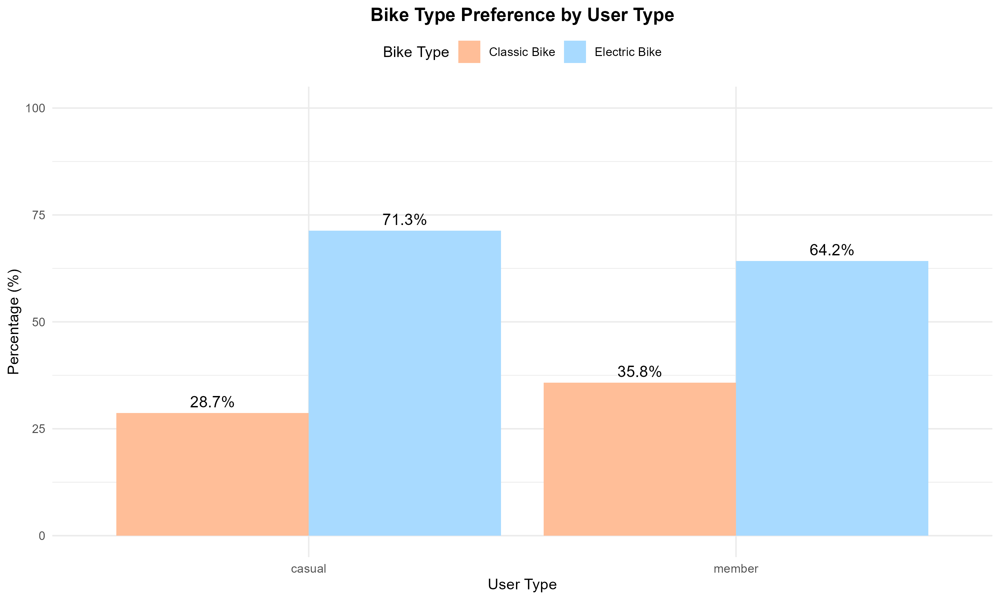

Casual riders show a stronger preference for electric bikes (71.3%) compared to members (64.2%), while members use classic bikes proportionally more (35.8% vs 28.7%), suggesting members are more willing to engage with traditional cycling experiences while casual users prioritize convenience and ease of use.

### Ride duration density distribution by bike type

```{r, eval=FALSE}
ride_dur = 
  data_clean |>
  ggplot(aes(x = duration_min, fill = rideable_type)) +
  geom_density(alpha = 0.5, linewidth = 1) +
  scale_fill_manual(values = c("classic_bike" = "#FFBE98", 
                              "electric_bike" = "#A8DAFF"),
                  labels = c("Classic Bike", "Electric Bike")) +
  labs(
    title = "Ride Duration Density Distribution by Bike Type",
    x = "Duration (minutes)",
    y = "Density",
    fill = "Bike Type"
  ) +
  theme_minimal() +
  theme(
    plot.title = element_text(hjust = 0.5),
    legend.position = "top"
  ) +
  xlim(0, 50)

ride_dur
```

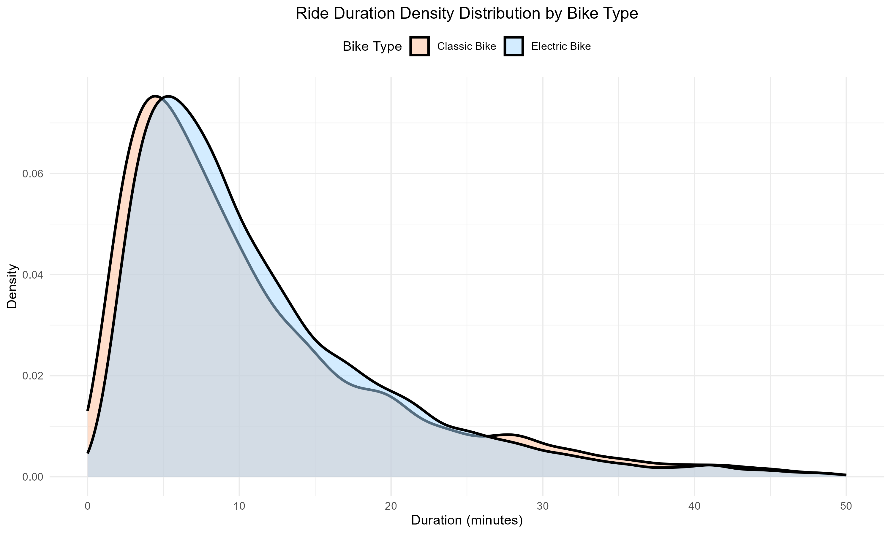

Both bike types show nearly identical ride duration distributions with peaks around 5 minutes, indicating that despite different technology, users use both classic and electric bikes for similarly short, quick trips, likely for urban commuting or short-distance travel.

### Hourly usage pattern by bike type

```{r, eval=FALSE}
hourly_usage =
  data_clean |>
  mutate(hour = hour(started_at)) |>
  group_by(hour, rideable_type) |>
  summarize(ride_count = n(), .groups = "drop") |>
  mutate(time_label = sprintf("%02d:00", hour)) |>
  ggplot(aes(x = time_label, y = ride_count, 
            color = rideable_type, group = rideable_type)) +
  geom_line(linewidth = 1.2) +
  geom_point(size = 3) +
  scale_color_manual(values = c("classic_bike" = "#FFBE98", 
                              "electric_bike" = "#A8DAFF"),
                  labels = c("Classic Bike", "Electric Bike")) +
  labs(
    title = "Hourly Usage Pattern by Bike Type",
    x = "Hour of Day",
    y = "Number of Rides",
    color = "Bike Type"
  ) +
  theme_minimal() +
  theme(
    plot.title = element_text(hjust = 0.5, face = "bold"),
    legend.position = "top"
  ) 

hourly_usage
```


Both bike types show clear commuter patterns with morning (8am) and evening (5pm) peaks, but electric bikes demonstrate significantly higher usage throughout the day, indicating they are the preferred choice for both commuting and general daytime transportation.

# Geographic and Station Analysis

```{r message=FALSE, warning=FALSE}
library(dplyr)
library(plotly)
library(tidyverse)
data <- read_csv("./data/citibike_sample_12k.csv")

citibike_clean = data %>% filter(
  !is.na(start_station_id),
  !is.na(end_station_id),
  !is.na(start_station_name),
  !is.na(end_station_name),
  !is.na(start_lat),
  !is.na(start_lng),
  !is.na(end_lat),
  !is.na(end_lng)
)

start_counts = citibike_clean %>%
  count(start_station_name, start_station_id, start_lat, start_lng, name = "count")

top10_sc = start_counts %>% slice_max(count, n = 10) %>%
  mutate(type = "Departures") %>%
  rename(station = start_station_name, lat = start_lat, lng = start_lng)

end_counts = citibike_clean %>%
  count(end_station_name, end_station_id, end_lat, end_lng, name = "count")

top10_ec = end_counts %>% slice_max(count, n = 10) %>%
  mutate(type = "Arrivals") %>%
  rename(station = end_station_name, lat = end_lat, lng = end_lng)

top10_total = bind_rows(top10_sc, top10_ec)

# Plot
station_flow = plot_ly() %>%
  add_trace(data=top10_sc, type="scattermapbox", mode="markers",
            lat=~lat, lon=~lng,
            marker=list(size= ~count*10, color = "green", sizemode="area", opacity=0.8), text = ~paste(station, count, sep=": "), name="Departures") %>%
  add_trace(data=top10_ec, type="scattermapbox", mode="markers",
            lat=~lat, lon=~lng,
            marker=list(size= ~count*10, color="blue", sizemode="area", opacity=0.8),
            text=~paste(station, count, sep=": "), name="Arrivals") %>%
  layout(title="Top 10 Citibike Stations in NYC",
         mapbox=list(style="open-street-map",
                     center=list(lat=40.749156, lon=-73.9916),
                     zoom=11.5))
station_flow
```

The figure above illustrates the 20 most frequently used stations in New York City over a 12-month period, among which 10 are the stations with the highest number of returned vehicles and the other 10 are those with the highest number of rented vehicles. It can be observed that these stations are mainly concentrated in Midtown and Downtown Manhattan. Notably, two stations—University Pl & E 14th St and W 21st St & 6th Ave that appear in both the top 10 lists of inflow and outflow stations. This indicates that these two stations have extremely high utilization rates and are located in areas with large population mobility, so appropriate additional investment should be allocated to them.

# Additional analysis

### Descriptive statistics

We first examined the distribution of the response variable, ride duration, in the October 2024 dataset. The raw duration values show a strong right-skewed distribution, with most trips concentrated below 20 minutes and a long tail extending beyond 100 minutes, as shown in the histogram. The mean duration is 12.28 minutes, while the median is 9.01 minutes, indicating that extreme long trips pull the mean upward

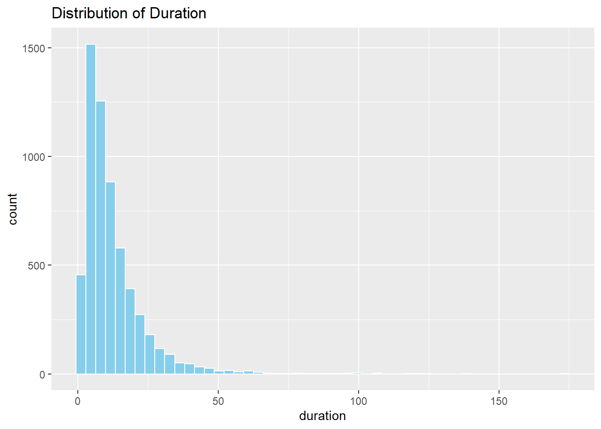

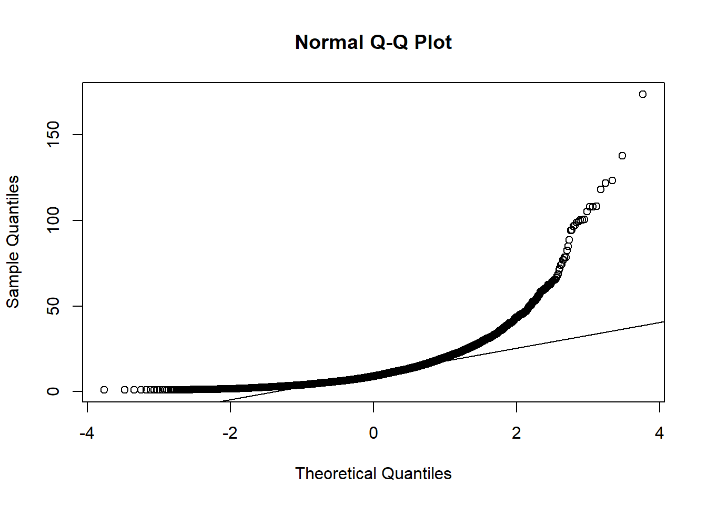

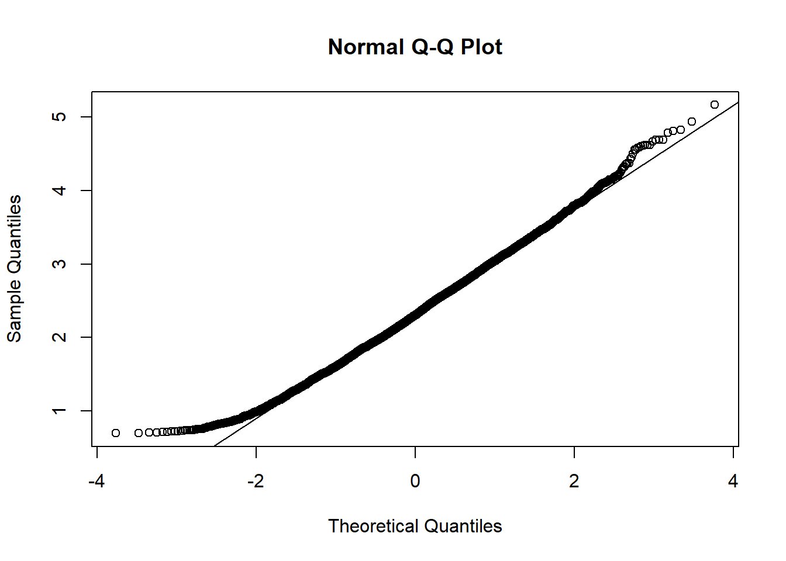

### Correlation heatmap

The correlation heatmap shows that the linear relationships between all predictors are extremely weak (all values ≤ 0.21), with weather conditions (precipitation and weather code at 0.21) showing the strongest. Among all independent variables, the user type shows the most noticeable linear relationship with bike duration (with a correlation of -0.22), while all other variables, including weather conditions, temperature, and wind speed, exhibit only an extremely weak linear correlation with riding duration.

```{r, eval=FALSE}

merged_data = read_csv("./data/merged_data_clean.csv")
names(merged_data)

selected_vars = 
  merged_data |>
  select(rideable_type, member_casual, temp_c, weather_code, wind_speed, precip_mm)

# Recode factors
data_encoded = 
  selected_vars |>
  mutate(
    rideable_type_num = as.numeric(factor(rideable_type)),
    member_casual_num = as.numeric(factor(member_casual)),
    weather_code_num = as.numeric(factor(weather_code))
  ) |>
  select(rideable_type_num, member_casual_num, temp_c, 
         weather_code_num, wind_speed, precip_mm)

cor_matrix = cor(data_encoded, use = "complete.obs")

# Rename column
colnames(cor_matrix) = c("rideable_type", "member_casual", "temp_c", 
                          "weather_code", "wind_speed", "precip_mm")
rownames(cor_matrix) = c("rideable_type", "member_casual", "temp_c", 
                          "weather_code", "wind_speed", "precip_mm")

cor_melted = melt(cor_matrix)

# Draw plots for all variables
htmap_all = 
  cor_melted |>
  ggplot(aes(x = Var1, y = Var2, fill = value)) +
  geom_tile(color = "white") +
  geom_text(aes(label = round(value, 2)), color = "black", size = 4) +
  scale_fill_gradient2(low = "blue", high = "red", mid = "white", 
                       midpoint = 0, limit = c(-1, 1),
                       name = "Correlation") +
  theme_minimal() +
  theme(axis.text.x = element_text(angle = 45, hjust = 1, vjust = 1),
        axis.title = element_blank(),
        plot.title = element_text(hjust = 0.5, face = "bold")) +
  labs(title = "Correlation Heatmap of All Variables") +
  coord_fixed()

htmap_all

# Export plot
ggsave(
  filename = "./results/correlation_heatmap_all_variables.png",
  plot = htmap_all,
  width = 10,
  height = 6,
  dpi = 300,
  bg = "white"
)
```

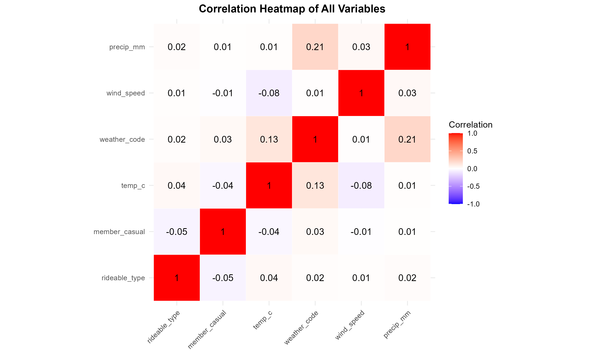
