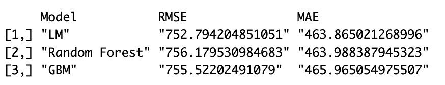
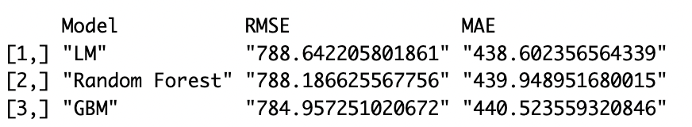
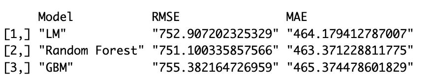
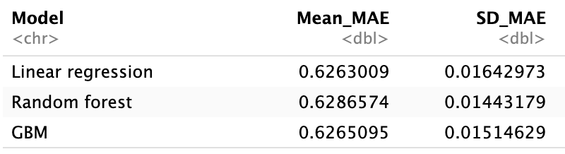
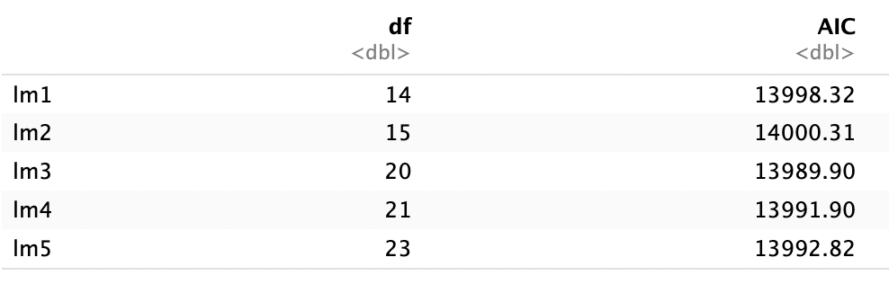
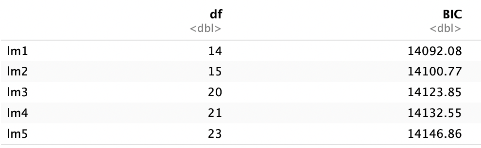
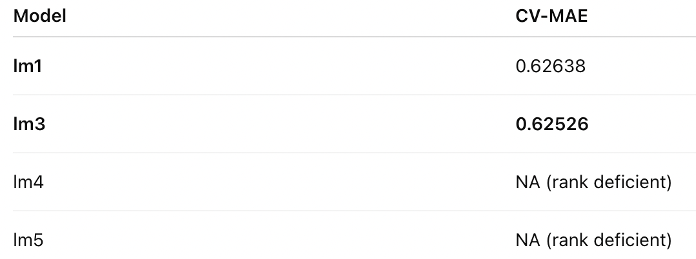
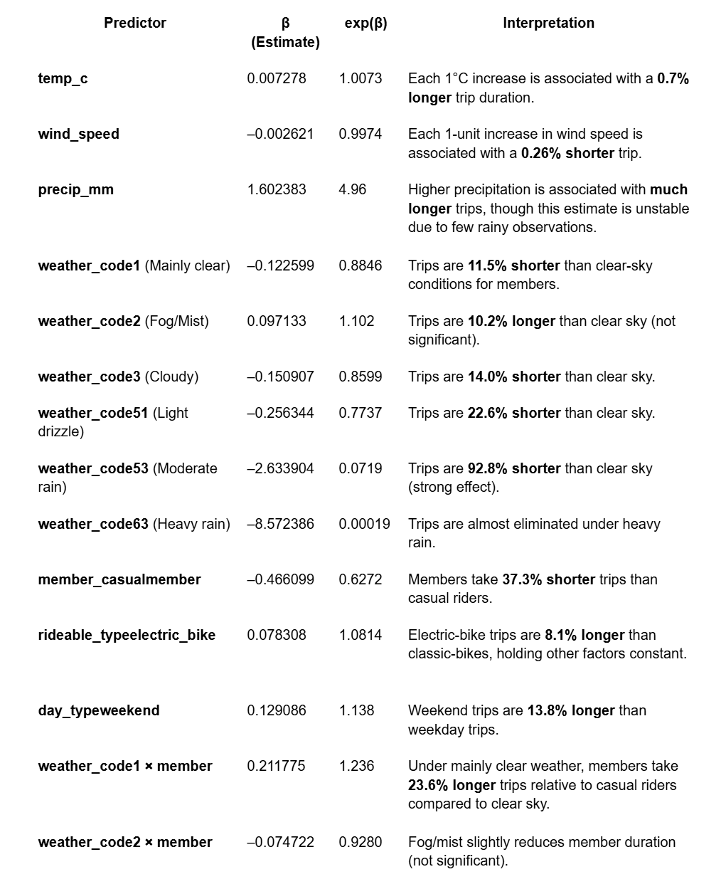
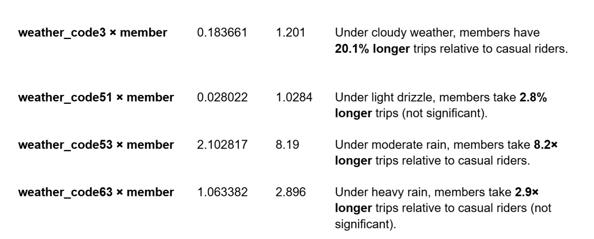
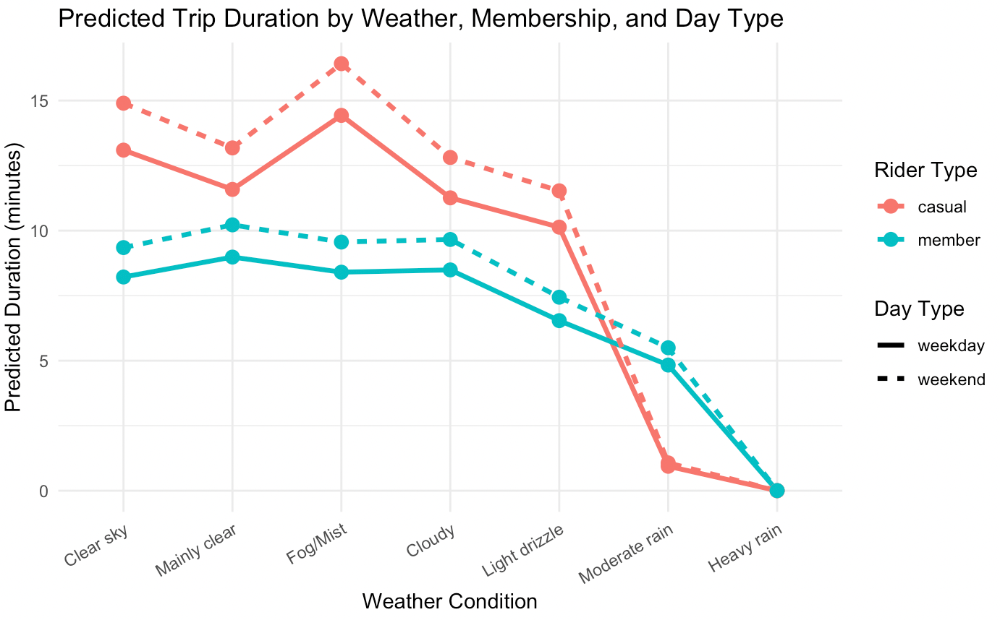

# Motivation
New York City's Citi Bike system has become an integral part of the urban transportation landscape, with over 25,000 bikes and 1,500 stations serving millions of riders annually across Manhattan, Brooklyn, Queens, and the Bronx.  Since its launch in 2013, the system has transformed how New Yorkers navigate the city, offering a flexible alternative that fills the gap between subway transit and walking.  The year 2024 is particularly meaningful as the system continues to expand its fleet and coverage across New York City.
In this project, we study Citi Bike usage patterns throughout 2024 to capture membership, seasonal changes, weather influences, commuter versus leisure patterns, and the effects of holidays or large events.  Comparing monthly data enables us to identify peak demand periods, user behavioral trends, and potential supply-demand imbalances.  By analyzing these trends and visualizing key performance metrics, the findings will inform strategies for system improvements including rebalancing, infrastructure planning, and initiatives that encourage further adoption of sustainable urban mobility.
As a core element of urban green transportation, shared bicycles are pivotal to tackling the "last mile" travel challenge, optimizing traffic structures, cutting carbon emissions, and easing urban congestion.  New York City as an iconic global metropolis with intricate transportation networks and diverse mobility needs — offers 2024 shared bicycle usage data that captures both post-pandemic shifts in travel behaviors and the latest advancements in urban traffic management.
Against this backdrop, this study analyzes 2024 shared bicycle usage data in New York City to uncover patterns in riding distribution, station utilization, and user travel habits.  Its goal is to address the gap in recent research while providing actionable insights to boost operational sustainability, strengthen coordination within urban public transportation systems, and advance green, low-carbon urban development.

# Related work
Our analysis was influenced by several sources that explored bike-sharing, mobility patterns, and regression modeling. Prior studies on Citi Bike ridership, including Javier Lopez Castillo’s “Multiple Linear Regression Analysis of Citi Bike Data”, demonstrated how trip duration and ridership can be associated with time of day, user type, and weather variables.  Additional inspiration came from class discussions about linear modeling, machine learning, cross-validation, and the importance of combining exploratory analysis with predictive modeling.  Existing transportation research also highlights how bike-share systems respond to weather, seasonal changes, and commuter flow patterns—topics that guided our choice of variables and modeling approach.

# Questions
At the start of the project, we focused on a core set of descriptive and operational questions:

1. How does Citi Bike usage vary across different months of 2024?
We expected seasonal patterns related to temperature, tourism, and commuter behavior.

2. Which stations experience the highest inflow and outflow?
This helped identify geographic hotspots and understand where rebalancing efforts may be needed.

3. How do usage behaviors differ between members and casual riders?
We wanted to compare ride duration, frequency, and bike type preference between user groups.

4. To what extent do weather conditions influence ride frequency and ride duration?
Temperature, precipitation, wind speed, and weather codes were expected to shape riding decisions.

As we progressed, additional questions naturally emerged:
1. How do bike types (classic vs. electric) differ in popularity and usage patterns?
2. Do weekends and weekdays show systematically different behaviors?
3. Can predictive models (linear regression, random forest, gradient boosting) estimate ride duration effectively?
4. Are rider behaviors affected differently by weather depending on whether the rider is a member or a casual user?

These new questions led us to incorporate interaction terms, compare models using cross-validated MAE, and build visual dashboards to more deeply explore temporal, spatial, and behavioral patterns.

# Data
### Raw data
Data source: 
Citi Bike Trip Data
This project uses the publicly available Citi Bike system data provided by Lyft through the official Citi Bike website: “https://citibikenyc.com/system-data”

Weather Data (Open-Meteo API):
Weather information was obtained from the Open-Meteo Weather API:
https://open-meteo.com/en/docs

### Data cleaning
Data Cleaning and Preparation

Sampling of Citi Bike Trip Data (12 Months)
Each month of 2024 contains between 2 and 6 Citi Bike CSV files, totaling approximately 50 million trip records across the year. To make the dataset computationally manageable for initial exploratory analysis and visualization, we randomly sampled 1,000 observations from each month. This produced a balanced dataset of 12,000 trips used for preliminary visualizations and descriptive analysis.

October Data Preparation
October contains 6 separate Citi Bike CSV files. We randomly selected 1,000 observations from each file (for a total of 6,000 October trips) to use for more detailed modeling and weather-matched analyses. During preprocessing, timestamps were converted to UTC format for consistency and alignment with weather data.

Weather Data Integration
Weather information for October 2024 was downloaded from the Open-Meteo Historical Weather API, using UTC timestamps to ensure consistency with Citi Bike timestamps.     The weather variables (e.g., temperature, precipitation, wind speed) were merged with the October trip data based on matching UTC time.

Computation of Trip Duration
A new variable, duration, was created as the difference between ended_at and started_at. The duration was converted to seconds for interpretability.

Outlier Removal and Data Filtering
Trips with erroneous or unrealistic duration values were excluded. Specifically, we removed trips with:
duration < 0 minutes (invalid end/start times), and
duration > 300 minutes (extreme long-duration outliers).

# Exploratory analysis

## User Behavior Analysis

To compare the behavioral patterns of Citi Bike members and casual riders, we analyzed the cleaned 2024 trip dataset with a focus on two key indicators: average ride duration and monthly ride counts. The visualizations reveal clear and consistent differences between the two groups across the entire year.

 

In terms of ride duration, casual riders consistently take longer trips than members in every month of 2024. Overall, casual riders typically spend between 15 and 21 minutes per trip, whereas members maintain a much shorter and more stable range of roughly 10 to 12 minutes. A noticeable spike in casual ride duration appears around April and May, which further widens the gap between the two user types. These differences align with the well-established behavioral patterns of Citi Bike users: casual riders often engage in leisure, tourism, or exploratory rides, which naturally leads to longer trip times, while members tend to use bikes for commuting or short point-to-point travel, resulting in shorter, more predictable ride durations.

The pattern becomes even more striking when examining ride frequency. Although casual riders spend more time per trip, overall system usage is overwhelmingly driven by members. In our dataset, members consistently completed around 750 to 850 trips per month, compared with significantly fewer trips from casual riders. Furthermore, casual ridership exhibits strong seasonality—low in winter, peaking during the summer months, and declining again in the fall—while member ridership remains comparatively stable throughout the year. This stability reinforces the idea that members rely on Citi Bike for routine, utilitarian transportation, whereas casual users are more sensitive to weather and seasonal tourism patterns.

The figure above presents the monthly distribution of cycling data over a 12-month period. The distribution of Citibike ride durations shows a strong seasonal pattern. Winter months have the shortest and most uniform ride times, suggesting essential and short-distance travel. As temperatures increase in spring and peak in summer, both median duration and variability rise, accompanied by more long rides exceeding 100 minutes. These patterns indicate that warm weather months encourage longer and more diverse cycling activities, while colder seasons constrain both duration and behavioral variability.

## Bike Type Comparison

### Monthly ride count comparison by bike type

Both bike types maintain relatively stable usage patterns throughout the year with minimal monthly fluctuation. Classic bike usage hits its lowest point in July (319 rides), possibly due to excessive heat. The usage of electric bikes is approximately twice that of classic bikes, averaging around 650 and 340 rides per month, respectively. Electric bikes are clearly more popular, likely because they require less physical effort and better serve practical purposes like commuting.

### Average ride duration comparison by bike type

Both bike types show clear seasonal trends, with longer rides during warmer months (May-October) and shorter rides in winter months (January, February, December). December shows a dramatic drop for both types, falling to around 9.7 minutes. The gap is most pronounced in spring/summer (April-July), where electric bikes average 0.5-1 minute longer per ride. In fall/winter months (September-December), the two converge, with classic bikes surpassing electric bikes briefly in September. Electric bikes generally have slightly longer average duration than classic bikes during most months. This may be because the electric assist enables them to travel farther distances comfortably. Classic bike riders maintain more consistent duration (11-13.4 minutes), suggesting they use bikes for predictable short trips.

### Market share trend by bike type

Electric bikes consistently dominate the market, holding approximately 65% market share throughout the year. Electric bikes gain approximately 4.5 % points of market share over the year. Electric bike share gradually increases from 63.5% (January) to peak at 68.1% (July), then stabilizes around 66-68% for the remainder of the year, while classic bikes experience a corresponding decline from 36.5% (January) to a low of 31.9% (July).

### Bike type preference by user type

Casual riders show a stronger preference for electric bikes (71.3%) compared to members (64.2%), while members use classic bikes proportionally more (35.8% vs 28.7%), suggesting members are more willing to engage with traditional cycling experiences while casual users prioritize convenience and ease of use.

### Ride duration density distribution by bike type

Both bike types show nearly identical ride duration distributions with peaks around 5 minutes, indicating that despite different technology, users use both classic and electric bikes for similarly short, quick trips, likely for urban commuting or short-distance travel.

### Hourly usage pattern by bike type

Both bike types show clear commuter patterns with morning (8am) and evening (5pm) peaks, but electric bikes demonstrate significantly higher usage throughout the day, indicating they are the preferred choice for both commuting and general daytime transportation.

# Additional analysis (Model Selection)
### Descriptive statistics

We first examined the distribution of the response variable, ride duration, in the October 2024 dataset. The raw duration values show a strong right-skewed distribution, with most trips concentrated below 20 minutes and a long tail extending beyond 100 minutes, as shown in the histogram. The mean duration is 12.28 minutes, while the median is 9.01 minutes, indicating that extreme long trips pull the mean upward

### Correlation heatmap

The correlation heatmap shows that the linear relationships between all predictors are extremely weak (all values ≤ 0.21), with weather conditions (precipitation and weather code at 0.21) showing the strongest. Among all independent variables, the user type shows the most noticeable linear relationship with bike duration (with a correlation of -0.22), while all other variables, including weather conditions, temperature, and wind speed, exhibit only an extremely weak linear correlation with riding duration.

## Model Selection
Select models from Multiple Linear Regression, Random Forest and Gradient Boosting Machine
1. Checking both RMSE and MAE for three baseline models
`duration ~ temp_c + wind_speed + precip_mm + weather_code + member_casual + rideable_type`

2. Checking RMSE and MAE for all three log model
`log_duration ~ temp_c + wind_speed + precip_mm + weather_code + member_casual + rideable_type`

3. Checking RMSE and MAE for all three reduced model 
`duration ~ temp_c + member_casual`

In this analysis, we use **Mean Absolute Error (MAE)** rather than **Root Mean Squared Error (RMSE)** as the primary evaluation metric. Trip duration in the Citi Bike data is highly right-skewed, with many extreme long-duration trips. Because RMSE squares the errors, it is disproportionately influenced by these outliers and therefore does not reflect typical prediction accuracy. In contrast, MAE weights all errors equally and is robust to skewed distributions, making it a more appropriate and interpretable metric for evaluating models on this dataset. For these reasons, MAE provides a fairer and more stable basis for model comparison.

Cross validation for three full model with log(duration)

Using 5-fold cross-validated MAE on the log-transformed duration outcome, we compared linear regression, random forest, and gradient boosting models. All three methods achieved very similar predictive accuracy, with MAE values around 0.63. Linear regression had the lowest cross-validated MAE (0.6263), followed closely by GBM (0.6265), while random forest performed slightly worse (0.6287). Given the nearly identical performance and the greater interpretability of linear regression, we selected the linear regression model for further refinement and diagnostic analysis.

## Multiple Linear Regression
We evaluated five candidate linear regression models for predicting the log-transformed trip duration. The models differed in their inclusion of polynomial terms and interaction terms:

Base model: `log(duration) ~ temp_c + wind_speed + precip_mm + weather_code + member_casual + rideable_type + day_typeweekend`

lm1: Base model with main effects only

lm2: Base model + polynomial temperature term

lm3: Base model + member × weather interaction

lm4: Polynomial + interaction model

lm5: Full model with all polynomials and interactions

Because linear models must balance prediction accuracy, interpretability, and parsimony, we compared these models using AIC, BIC, and 5-fold cross-validated MAE.

1. AIC Comparison (Lower = Better)
AIC penalizes model complexity but allows moderately complex models if they improve prediction.

lm3 achieves the lowest AIC, indicating it provides the best balance between fit and complexity.
lm4 and lm5 are slightly worse, suggesting additional polynomial and interaction terms do not improve prediction.
Simple models (lm1 and lm2) perform worse under AIC.

2. BIC Comparison (Lower = Better)
BIC penalizes complexity more heavily than AIC and often prefers simpler models.

lm1 has the lowest BIC, clearly preferred due to fewer parameters.

Models with higher complexity (lm3–lm5) are heavily penalized.

3. CV-MAE Comparison (Prediction Accuracy)
To evaluate out-of-sample prediction performance, we used 5-fold cross-validation with mean absolute error (MAE) on the log(duration) outcome.

lm3 performs best, with the lowest cross-validated MAE.
lm1 is close but slightly worse.
lm4 and lm5 suffer from rank deficiency, meaning polynomial+interaction structures created multicollinearity and empty factor levels, making them unsuitable for CV or reliable interpretation.

lm3 is selected as the final regression model because it achieves the best balance of predictive accuracy, statistical justification, interpretability, and stability.  It outperforms the base model (lm1) in AIC and cross-validated MAE while avoiding the multicollinearity and rank-deficiency problems seen in more complex models (lm4 and lm5).

4. The final model
`log(duration)∼temp_c+wind_speed+precip_mm+weather_code+member_casual+rideable_type+(member_casual×weather_code)+ day_typeweekend`
N = 5987
Residual SE = 0.777
Adjusted R² = 0.05704

While R² is low (as expected for human mobility data), the model is statistically significant (F = 20.6, p < 2e−16) and captures several strong behavioral and weather-related patterns.

A QQ plot confirms that the raw duration values deviate substantially from normality, especially in the upper quantiles. To reduce skewness, we applied a log transformation using log(duration + 1). After transformation, the mean and median become 2.33 and 2.30, much closer together, and the QQ plot shows a more linear pattern.

The final model uses a log-transformed trip duration as the outcome and includes weather conditions, rider type, bike type, day type, and weather–membership interactions.

Temperature has a positive association with trip duration (β = 0.0073, p < 0.001), indicating that warmer weather slightly increases ride length, while wind speed has a negative effect (β = –0.0026, p = 0.038), suggesting that stronger winds shorten trips.  Several weather categories reduce duration compared with clear weather, especially heavy rain (weather_code 53, β = –2.63, p = 0.006) and thunderstorms (weather_code 63, β = –8.57, p = 0.045).

Casual riders take significantly longer trips than members (β = –0.466, p < 2e-16 on log scale), and electric bikes are associated with slightly longer duration (β = 0.078, p < 0.001). Weekend trips are about 13.8% longer than weekday trips (exp(0.1291) = 1.138; p < 0.001).

Interaction terms show that weather conditions affect casual riders differently than members. For example, in weather_code 1, casual riders ride 24% longer than members (exp(0.2118) ≈ 1.24; p = 0.009), and similar differential effects appear in codes 3 and 53.

The model explains a modest amount of variation in duration (Adjusted R² ≈ 0.057), which is expected for human mobility data. However, the included predictors are statistically significant and provide meaningful insights into how weather, membership, and day type jointly influence trip duration.

# Discussion
Our research provides a comprehensive view of Citibank's bicycle usage patterns throughout 2024, combining travel-level data with weather records to better understand how environmental conditions, user characteristics, and time factors influence cycling time and behavior. Several consistent themes have emerged in exploratory analysis, descriptive statistics, and predictive modeling, providing insights into system performance and user decision-making.

1. User behavior and system utilization

Looking at the data throughout the year, members and temporary passengers show significantly different patterns. The travel time of leisure cyclists is usually 30-40% longer than that of members, which is in line with expectations: leisure cyclists are more likely to engage in leisure, tourism or scenic exploration, while members view Citibank bikes as a practical mode of transportation. Although the cycling time is longer, the total number of trips made by ordinary users is much less, which indicates that the Citibank bicycle system is mainly maintained by daily commuters. Seasonal patterns magnify these differences: leisure foot traffic surges sharply in warm months, drops in winter, while membership foot traffic remains stable throughout the year.

The preference for electric bicycles is also strong and lasting. Electric bicycles have always accounted for about two-thirds of all rides, which reflects that they are more convenient and can reduce physical exertion - especially over long distances or in hilly areas. The proportion of members using classic bicycles is higher than that of ordinary cyclists, which indicates that familiarity, cost sensitivity or commuting habits may have played a role. These trends highlight the opportunities for operational planning, such as expanding the maintenance capacity of electric bicycles, adjusting charging infrastructure, or customizing membership rewards.

2. Time and geographical layout

Time analysis shows that the commuting peak occurs significantly at 8 a.m. and 5 p.m., which is consistent with the working schedule on weekdays. Cycling time increases significantly in spring and summer, which may reflect the improvement of weather and the increase in leisure activities. Spatial analysis confirms that the busiest stations are concentrated in Midtown and Lower Manhattan, which are densely populated, have a large flow of people and extensive multimodal transport connections. The presence of stations on both the "Most Popular Pick-up Points" and "Most Popular drop-off Points" lists indicates that areas with intense cycling activities may benefit from targeted rebalancing efforts.

These insights are crucial for resource allocation, especially for optimizing bicycle allocation, preventing shortages during peak hours, and reducing operational pressure at high-traffic sites.

3. The influence of weather on cycling time

The meaningful association between weather variables and cyclical behavior is clarified by regression models in terms of their direction and magnitude. Temperature has a minor but significant positive impact on the duration of the stroke, while higher wind speeds will slightly shorten the stroke. Precipitation has greatly reduced the predicted duration - especially under moderate and heavy rain conditions, cycling activities have almost vanished. This is consistent with the well-documented pattern in urban traffic research: bad weather conditions suppress the willingness to ride bikes and the length of travel.

The weather also has an important relationship with the type of rider. Temporary riders are more sensitive to weather changes. In cloudy or rainy conditions, their riding time drops more quickly. However, members maintain a relatively stable travel length, except in the worst weather categories. These differences may reflect the underlying purposes of travel - commuting offers less option, while leisure travel responds more strongly to environmental comfort.

4. The impact of cycling on weekends and weekdays

Incorporating weekend metrics into the regression model revealed significant behavioral differences on different days of the week. Even after adjusting for the weather, the type of bicycle and the category of cyclists, the duration of weekend travel is approximately 14% longer than that of weekdays. This reflects people's shift from utilitarian travel on weekdays to leisure and exploratory cycling on weekends. The interaction between weather types and rider types (as shown in the prediction graph) indicates that under favorable weather conditions, the weekend effect is most pronounced for leisure riders.

5. Predictive Modeling and Interpretation

Although the final regression model explains the moderate variation ratio of travel duration (`adjusted R²≈0.057`), this is expected for human mobility data, where individual decisions are influenced by unobserved factors such as emotions, purposes, social plans, street traffic, or the proximity of destinations. However, the model still possesses statistical robustness and provides an interpretable and meaningful relationship between predictors and cycling time.

## Limitation
Although it provides meaningful insights into the usage patterns of Citibank bicycles, our analysis has some limitations.

The ability to perform a complete time series analysis is limited.
Although we examined monthly and hourly trends, our dataset is sampled (1,000 trips per month), and thus is not suitable for full-time modeling, such as ARIMA, STL decomposition, long-term prediction, or dynamic seasonal detection. A complete time series analysis requires over 50 million records starting from 2024 to maintain fine-grained temporal continuity.

Focus on the duration of the trip rather than other outcomes.
Our prediction model is centered on duration, but other meaningful results - such as ride frequency, departure time patterns, or changing station demand over time - are not modeled. Investigating how weather, user type and bicycle type affect ride time (start_at time) can reveal other behavioral insights beyond duration.

Lack of information on holidays and special events.
Our model cannot take into account major festivals (such as July 4th), marathons, parades, subway disruptions or other large-scale events that have a significant impact on bicycle usage. If the event calendar is not merged into the dataset, these impacts remain unmeasurable and may lead to unexplained changes in foot traffic and duration.

