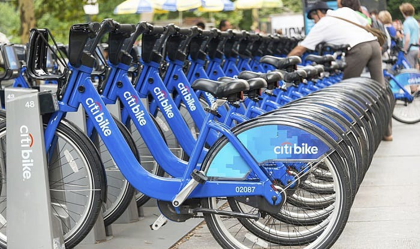

### Background

New York City's Citi Bike system, launched in 2013, has rapidly grown into one of the world’s largest bike-sharing networks, with over 25,000 bikes and 1,500 stations serving millions of riders each year.  As a flexible mode of transportation, Citi Bike fills the gap between walking and public transit, helping address the “last-mile” challenge, reduce congestion, and promote low-carbon urban mobility.

The year 2024 marks a significant period of expansion for the system, reflecting evolving travel patterns in a post-pandemic city and ongoing improvements in transportation planning.  This project analyzes 2024 Citi Bike trip data—combined with weather information—to understand patterns in ridership, membership differences, temporal trends, commuter versus leisure behavior, and station utilization.  By comparing usage across months and conditions, we identify peak demand periods, behavioral shifts, and potential imbalances in supply and demand.

The insights gained from this analysis support strategies for system optimization, including rebalancing, infrastructure development, and policies that strengthen sustainable urban transportation in New York City.
          
 

### Video

### Initial Questions

- How does Citi Bike usage vary across different months of 2024?
- Which stations experience the highest inflow and outflow?
- How do usage behaviors differ between members and casual riders?
- To what extent do weather conditions (temperature, precipitation, wind) influence ride frequency and ride duration?

        

### What We Do

- Collect, clean and integrate the full-year data of 2024 for visualization, and compare the monthly data of Citibank bicycle stations.
- Collate Citigroup's bicycle travel data for October 2024 and hourly historical weather data to create a consistent and usable dataset for exploration and modeling analysis.
- Build predictive models - including linear regression and machine learning methods - to assess how weather conditions, rider types, bicycle types and weather types affect trip duration and overall system usage.

        

### Contact Us

Contact us: 
<a href="mailto:ml5308@cumc.columbia.edu">ml5308@cumc.columbia.edu</a> 
Visit project website here: 
<a href="https://github.com/Chenchen-7/p8105_final_project" target="_blank">github.com/Chenchen-7/p8105_final_project</a>.
        

